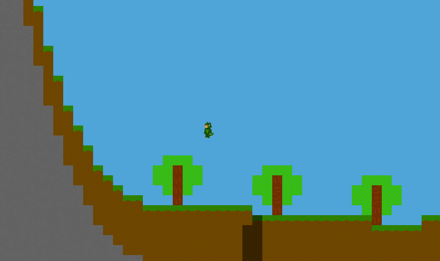
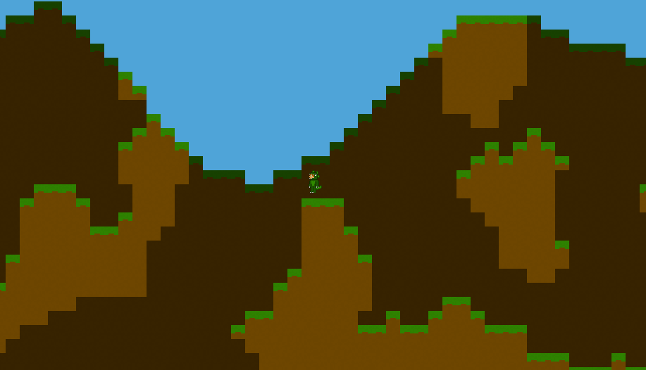
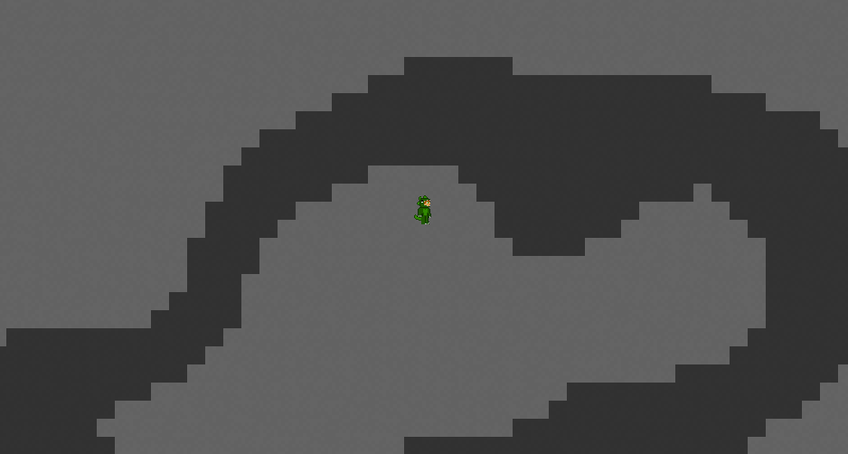
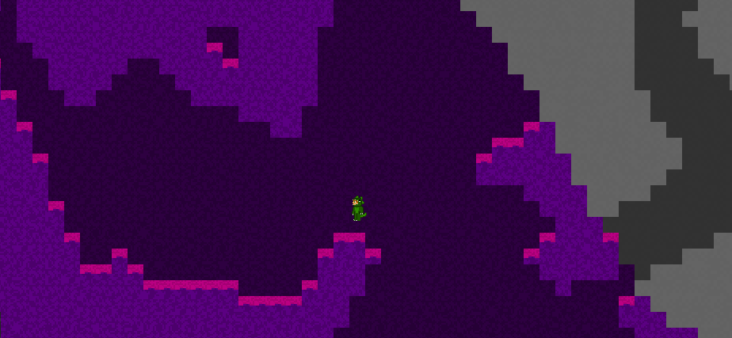
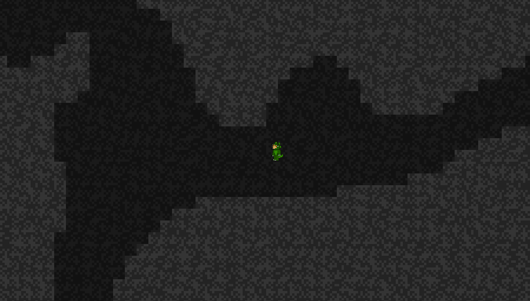

# Terrain Structure Generation

A 2D world generator experiment, complete with caves, structures and biomes. Made in Godot. World data is asynchronously loaded and saved as the player moves through the world.

Surface with trees. 
 

Partially exposed surface landscape. 
 

Caves below the surface. 
 

Biome deep under ground. 
 

Caverns below the underground biome. 
 
